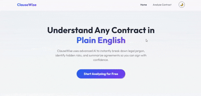
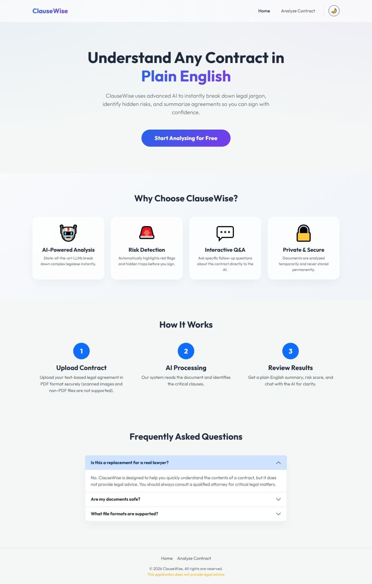
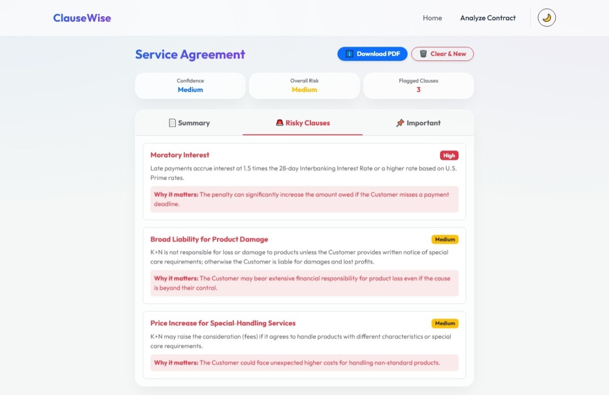

# ⚖️ ClauseWise

> **AI-Powered Legal Contract Analyzer & Assistant**

ClauseWise is an AI-powered web application that helps users understand legal contracts by transforming complex legal language into clear, easy-to-understand explanations. It automatically identifies risky clauses, summarizes important terms, and allows users to ask questions about their contracts through an intelligent AI assistant.

<p align="center">

[](https://react.dev/)
[](https://nodejs.org/)
[](https://vitejs.dev/)
[](https://groq.com/)
[](https://getbootstrap.com/)
[](LICENSE)

</p>

<p align="center">
  <a href="https://clause-wise-chatbot.vercel.app/"><strong>🌐 Live Demo</strong></a>
  •
  <a href="https://github.com/gulhassan0599/clausewise"><strong>📂 GitHub Repository</strong></a>
</p>

---

# 📑 Table of Contents

- [Overview](#-overview)
- [Why ClauseWise?](#-why-clausewise)
- [The Problem & Target Audience](#-the-problem--target-audience)
- [Live Demo & GitHub Repository](#-live-demo--github-repository)
- [Demo GIF](#-demo-gif)
- [Key Features](#-key-features)
- [AI Feature](#-ai-feature-detailed)
- [System Prompt Summary](#-system-prompt-summary)
- [Technology Stack](#-technology-stack)
- [System Architecture Diagram](#-system-architecture)
- [Project Structure](#-project-structure)
- [Screenshots](#-screenshots)
- [Installation & Local Setup](#-installation--local-setup)
- [Environment Variables](#-environment-variables)
- [API Endpoints](#-api-endpoints)
- [Privacy & Security](#-privacy--security)
- [Future Improvements](#-future-improvements)
- [Challenges & Learnings](#-challenges--learnings)
- [Contributing](#-contributing)
- [License](#-license)
- [Disclaimer](#-disclaimer)

---

# 📖 Overview

Legal contracts are often lengthy, technical, and difficult for non-lawyers to understand. As a result, many people agree to contracts without fully understanding their obligations, rights, or potential risks.

**ClauseWise** addresses this problem by using Artificial Intelligence to analyze legal contracts and present the information in a simple, structured, and beginner-friendly format. Instead of reading dozens of pages filled with legal terminology, users receive a concise summary, an overall risk assessment, explanations of important clauses, and an interactive chatbot that answers questions about the uploaded document.

The application combines modern web technologies with Large Language Models (LLMs) to provide fast, context-aware contract analysis while maintaining a simple and intuitive user experience.

Whether you're reviewing a rental agreement, employment contract, freelance agreement, service agreement, or business partnership document, ClauseWise helps you understand what you're signing before making a decision.

---

# 💡 Why ClauseWise?

Every day, people sign legal documents without reading or fully understanding them—not because they don't care, but because legal language is complex, time-consuming, and often inaccessible to individuals without legal training.

Hiring a lawyer for every contract is impractical and expensive, especially for students, freelancers, employees, and small business owners who regularly encounter agreements in their personal and professional lives.

ClauseWise was built to bridge this gap by providing an accessible AI-powered assistant that simplifies legal contracts without replacing professional legal advice.

### The problem it solves

- Helps users understand complicated legal language.
- Identifies potentially risky or unfair clauses.
- Highlights the most important terms before signing.
- Reduces the time required to review lengthy contracts.
- Enables users to ask questions about their contract in natural language.

### Who is it for?

- 👨🎓 Students reviewing internship or scholarship agreements.
- 🏠 Renters reading lease or rental contracts.
- 💼 Employees evaluating employment offers.
- 🧑💻 Freelancers reviewing client agreements.
- 🏢 Small business owners analyzing vendor or partnership contracts.
- 👥 Anyone who wants to better understand legal documents before signing them.

ClauseWise is **not a replacement for a lawyer**. Instead, it serves as an intelligent first-review assistant that helps users gain confidence and awareness before seeking professional legal advice when necessary.

# 🎯 The Problem & Target Audience

## The Problem

Legal contracts are an essential part of everyday life, but they are often written in complex legal language that can be difficult for non-lawyers to understand. Whether signing a rental agreement, employment contract, freelance agreement, or business partnership, many people accept terms without fully understanding their rights, obligations, or potential risks.

Several challenges contribute to this problem:

- 📄 Lengthy documents that require significant time to review.
- ⚖️ Complex legal terminology that is difficult for the average person to interpret.
- 🚨 Hidden or unfavorable clauses that may go unnoticed.
- 💰 High legal consultation costs for routine contract reviews.
- ⏳ Limited time to carefully read every clause before signing.

As a result, users may unknowingly agree to unfavorable conditions, unnecessary liabilities, or restrictive terms.

ClauseWise addresses this problem by providing an AI-powered first-pass analysis that converts complex legal contracts into clear, understandable insights within seconds.

---

## 👥 Target Audience

ClauseWise is designed for anyone who needs to understand a legal contract before signing it.

### Students
Review internship agreements, scholarship contracts, university documents, or accommodation leases.

### Employees
Analyze employment contracts, NDAs, confidentiality agreements, and offer letters before accepting a job.

### Freelancers
Understand client agreements, payment terms, intellectual property clauses, and project obligations.

### Small Business Owners
Review vendor contracts, partnership agreements, service contracts, and procurement documents.

### General Users
Anyone who wants a quick, beginner-friendly explanation of a legal document before making an important decision.

> **Note:** ClauseWise is intended as an educational and informational assistant. It does **not** replace professional legal advice.

---

# 🌐 Live Demo & GitHub Repository

### 🚀 Live Application

**Try ClauseWise here:**

👉 **https://clause-wise-chatbot.vercel.app/**

---

### 📂 Source Code

Explore the complete source code on GitHub:

👉 **https://github.com/gulhassan0599/clausewise**

---

## ⭐ Quick Start

1. Open the live application.
2. Upload a legal contract (PDF).
3. Wait a few seconds for AI analysis.
4. Review the summary, risks, and important clauses.
5. Ask follow-up questions in the AI chatbot.
6. Download the analysis report as a PDF.

---

# 🎬 Demo GIF


 
---

# ✨ Key Features

ClauseWise provides a complete AI-powered workflow for understanding legal contracts.

## 📄 Smart PDF Upload

- Upload text-based legal contracts in PDF format.
- Fast text extraction using **pdf-parse**.
- Memory-based processing with no permanent file storage.

---

## 🛡️ Contract Validation

Before performing any analysis, ClauseWise verifies whether the uploaded document is actually a legal contract.

If the document is not recognized as a contract, users receive a friendly explanation instead of inaccurate AI results.

---

## 🤖 AI Contract Analysis

The AI automatically analyzes the uploaded document and generates:

- Contract type
- Plain-English summary
- Overall risk level
- Confidence score
- Important clauses
- Potentially risky clauses
- Recommendations

---

## 🚨 Risk Detection

ClauseWise identifies clauses that may expose users to unnecessary legal or financial risk.

Examples include:

- Unlimited liability
- Automatic renewals
- Early termination penalties
- One-sided obligations
- Vague wording
- Unfair payment terms

Each risk includes:

- Severity level
- Explanation
- Why it matters

---

## 📌 Important Clause Highlighting

Instead of reading dozens of pages, users receive the most important clauses summarized into an easy-to-read dashboard.

Examples include:

- Payment Terms
- Contract Duration
- Renewal Conditions
- Termination Rules
- Confidentiality
- Intellectual Property
- Dispute Resolution

---

## 💬 Interactive AI Chatbot

After analysis, users can ask follow-up questions such as:

- "What happens if I terminate early?"
- "Who owns the intellectual property?"
- "Are there any hidden risks?"
- "What are my payment obligations?"

The chatbot answers using only the uploaded contract as context, helping prevent hallucinations and unrelated responses.

---

## 📑 Download Analysis Report

Users can generate a professional PDF report containing:

- Contract summary
- Overall risk score
- Important clauses
- Risky clauses
- AI recommendations

The report can be saved or shared for future reference.

---

## 🌙 Modern Responsive UI

- Fully responsive layout
- Mobile-friendly design
- Dark mode / Light mode
- Glassmorphism-inspired interface
- Smooth animations and transitions

---

## 🔒 Privacy First

ClauseWise prioritizes user privacy.

- Files are processed entirely in server memory.
- Uploaded PDFs are never permanently stored.
- No authentication required.
- No user data is retained after processing.

---

# 🤖 AI Feature (Detailed)

Artificial Intelligence is the core of ClauseWise. Rather than simply extracting text from a PDF, the application uses a Large Language Model (LLM) to understand the contract, identify important legal information, assess potential risks, and explain everything in clear, beginner-friendly language.

## How It Works

The AI workflow consists of several stages:

```
User Uploads PDF
        │
        ▼
Extract Text (pdf-parse)
        │
        ▼
Validate Document Type
        │
        ▼
Send Text + System Prompt
        │
        ▼
Groq LLM
(openai/gpt-oss-120b)
        │
        ▼
Structured JSON Response
        │
        ▼
Interactive Dashboard
        │
        ▼
Context-Aware AI Chatbot
```

---

## AI Analysis Responsibilities

The AI is instructed to:

- Determine whether the uploaded file is a legal contract.
- Reject unsupported or unrelated documents.
- Identify the contract type.
- Produce a concise plain-English summary.
- Assess the overall risk level.
- Detect potentially risky clauses.
- Explain why each clause may be important.
- Highlight critical contract terms.
- Suggest practical recommendations.
- Return structured JSON for reliable frontend rendering.

---

## AI Chat Assistant

Once analysis is complete, users can continue interacting with the contract through a conversational AI assistant.

The chatbot:

- Answers only questions related to the uploaded contract.
- Uses the extracted contract text as context.
- Uses previous conversation history for continuity.
- Politely rejects unrelated questions.
- Explains legal concepts in simple language.
- Avoids providing misleading legal advice.

---

## Prompt Engineering

ClauseWise uses carefully designed system prompts to ensure consistent, safe, and reliable responses.

The prompts define:

- AI identity and behavior
- Scope limitations
- Response formatting
- Tone of communication
- JSON output schema
- Contract validation rules
- Hallucination prevention
- Safety constraints

Instead of allowing free-form responses, the model is instructed to return structured JSON, making the application's analysis predictable and easy to display.

---

## AI Model

| Component | Technology |
|-----------|------------|
| AI Provider | Groq |
| Model | openai/gpt-oss-120b |
| Purpose | Contract understanding & conversational analysis |
| Output Format | Structured JSON |
| Response Style | Professional, beginner-friendly, concise |

---

## Why AI?

Traditional keyword-based contract analysis can only detect predefined words or phrases.

ClauseWise uses an LLM because it can:

- Understand context instead of keywords.
- Explain legal language in simple English.
- Identify nuanced legal risks.
- Answer follow-up questions naturally.
- Produce structured, human-readable analyses.

This makes ClauseWise significantly more useful than a simple PDF parser or keyword scanner while remaining easy to use for everyday users.

# 🧠 System Prompt Summary

ClauseWise uses carefully engineered system prompts to ensure the AI produces consistent, reliable, and safe responses. Rather than allowing unrestricted conversation, the AI is guided by explicit instructions that define its role, scope, response format, and behavior.

## Primary Objectives

The AI is instructed to:

- Verify whether the uploaded document is a legal contract.
- Reject unsupported or unrelated documents.
- Identify the contract type.
- Generate a concise, beginner-friendly summary.
- Detect potentially risky clauses.
- Explain why each risk matters.
- Highlight important contract terms.
- Assign an overall risk level.
- Provide practical recommendations.
- Return responses in a structured JSON format for frontend rendering.

---

## Safety & Behavioral Rules

The system prompt ensures that the AI:

- Never claims to be a lawyer.
- Does not provide legal advice.
- Avoids hallucinating information that is not present in the contract.
- Uses only the uploaded document as its knowledge source.
- Explains legal concepts in simple, non-technical language.
- Maintains a professional, neutral, and unbiased tone.
- Produces predictable, machine-readable responses.

---

## Chatbot Constraints

The conversational assistant follows additional rules to maintain relevance.

It:

- Answers only questions related to the uploaded contract.
- Uses the extracted contract text and previous conversation history as context.
- Politely declines unrelated questions.
- Never invents clauses or legal facts.
- Encourages users to consult qualified legal professionals for important legal decisions.

---

## Structured Output

Instead of generating free-form responses, the AI returns structured JSON containing:

- Document validation
- Contract type
- Executive summary
- Overall risk assessment
- Important clauses
- Risky clauses
- Recommendations
- Confidence score

This structured approach makes the application more reliable, easier to maintain, and simpler to display through the frontend dashboard.

---

# 🛠️ Technology Stack

| Category | Technologies |
|-----------|--------------|
| **Frontend** | React 19, Vite, React Router DOM, Bootstrap 5, Custom CSS |
| **Backend** | Node.js, Express.js |
| **AI Provider** | Groq API |
| **AI Model** | openai/gpt-oss-120b |
| **PDF Processing** | pdf-parse |
| **File Upload** | Multer (Memory Storage) |
| **PDF Reports** | jsPDF |
| **Markdown Rendering** | React Markdown |
| **Version Control** | Git & GitHub |
| **Frontend Hosting** | Vercel |
| **Backend Hosting** | Railway |
| **Development Tools** | VS Code, Postman, npm |

---

# 🏗️ System Architecture

The following diagram illustrates the complete workflow of ClauseWise.

```text
                           ┌──────────────────────────┐
                           │          User            │
                           └────────────┬─────────────┘
                                        │
                              Upload Contract PDF
                                        │
                                        ▼
                    ┌────────────────────────────────┐
                    │      React Frontend (Vite)     │
                    │                                │
                    │ • Upload Interface             │
                    │ • Dashboard                    │
                    │ • AI Chat                      │
                    │ • PDF Report Generator         │
                    └───────────────┬────────────────┘
                                    │
                             REST API Request
                                    │
                                    ▼
                    ┌────────────────────────────────┐
                    │      Express Backend           │
                    │                                │
                    │ • Multer (Memory Upload)       │
                    │ • PDF Text Extraction          │
                    │ • Prompt Management            │
                    │ • AI Request Handling          │
                    └───────────────┬────────────────┘
                                    │
                           Extracted Contract Text
                                    │
                                    ▼
                    ┌────────────────────────────────┐
                    │         Groq API              │
                    │  openai/gpt-oss-120b Model    │
                    └───────────────┬────────────────┘
                                    │
                          Structured JSON Response
                                    │
                                    ▼
                    ┌────────────────────────────────┐
                    │      Analysis Dashboard        │
                    │                                │
                    │ • Summary                      │
                    │ • Risk Score                   │
                    │ • Important Clauses            │
                    │ • Risky Clauses                │
                    │ • AI Chat                      │
                    │ • PDF Report                   │
                    └────────────────────────────────┘
```

---

# 📂 Project Structure

```text
ClauseWise/
│
├── client/
│   ├── public/
│   │
│   └── src/
│       ├── assets/
│       ├── components/
│       ├── pages/
│       ├── services/
│       ├── utils/
│       ├── App.jsx
│       └── main.jsx
│
├── server/
│   ├── controllers/
│   ├── middlewares/
│   ├── prompts/
│   ├── routes/
│   ├── services/
│   ├── app.js
│   └── server.js
│
├── screenshots/
│
├── README.md
├── LICENSE
└── .gitignore
```

### Folder Overview

| Folder | Description |
|---------|-------------|
| `client/` | React frontend application |
| `server/` | Express backend and API |
| `components/` | Reusable UI components |
| `pages/` | Application pages |
| `services/` | API communication and business logic |
| `middlewares/` | File upload and error handling |
| `prompts/` | AI system prompts and JSON schemas |
| `controllers/` | API request handlers |
| `screenshots/` | Images used in the README |

---

# 📸 Screenshots

---

## 🏠 Landing Page

Displays the modern homepage where users can learn about ClauseWise and upload a contract for analysis.



---

## 📄 Upload & Analysis

Shows the contract upload interface and the generated AI analysis dashboard.


---

## 🚨 Risk Detection

Illustrates how ClauseWise highlights potentially risky clauses and explains why they matter.



---

## 💬 AI Chat Assistant

Demonstrates the interactive chatbot answering questions about the uploaded contract.


---

# 🚀 Installation & Local Setup

Follow the steps below to run ClauseWise on your local machine.

---

## 1. Prerequisites

Ensure the following software is installed before starting:

- **Node.js** (v18 or later)
- **npm** (comes with Node.js)
- A **Groq API Key**
- Git

Verify your installation:

```bash
node -v
npm -v
git --version
```

---

## 2. Clone the Repository

```bash
git clone https://github.com/gulhassan0599/clausewise.git

cd clausewise
```

---

## 3. Backend Setup

Navigate to the server directory.

```bash
cd server
```

Install dependencies.

```bash
npm install
```

Create a `.env` file using the provided example.

```bash
cp .env.example .env
```

(Or manually create a `.env` file if an example file is unavailable.)

Start the backend server.

```bash
npm start
```

The backend will run on:

```
http://localhost:5000
```

---

## 4. Frontend Setup

Open a **new terminal**.

Navigate to the frontend.

```bash
cd client
```

Install dependencies.

```bash
npm install
```

Start the development server.

```bash
npm run dev
```

The frontend will run on:

```
http://localhost:5173
```

---

## 5. Open the Application

Visit:

```
http://localhost:5173
```

Upload a legal contract PDF and start analyzing.

---

# ⚙️ Environment Variables

The backend requires a Groq API key to communicate with the AI model.

Create a `.env` file inside the **server** directory.

```env
PORT=5000

GROQ_API_KEY=your_groq_api_key_here
```

### Variable Description

| Variable | Description |
|-----------|-------------|
| `PORT` | Port used by the Express server |
| `GROQ_API_KEY` | API key used to access the Groq LLM |

> **Important:** Never commit your `.env` file or API keys to GitHub.

---

## Project Environment Structure

```text
server/
│
├── .env
├── server.js
└── package.json
```

---

# 🔌 API Endpoints

ClauseWise exposes a simple REST API for contract analysis and AI-powered conversations.

| Method | Endpoint | Description |
|---------|----------|-------------|
| **POST** | `/api/contracts/analyze` | Uploads a contract PDF and returns the AI-generated analysis. |
| **POST** | `/api/contracts/chat` | Sends a user question and receives a context-aware response about the uploaded contract. |

---

## Analyze Contract

**Endpoint**

```
POST /api/contracts/analyze
```

**Content Type**

```
multipart/form-data
```

### Request

| Field | Type | Required |
|--------|------|----------|
| `file` | PDF File | ✅ |

### Response

Returns structured JSON containing:

- Contract validation
- Contract type
- Summary
- Overall risk level
- Confidence score
- Important clauses
- Risky clauses
- Recommendations

---

## Chat With Contract

**Endpoint**

```
POST /api/contracts/chat
```

**Content Type**

```json
application/json
```

### Request Body

```json
{
  "question": "What happens if I terminate the agreement early?",
  "contractText": "...",
  "analysis": { }
}
```

### Response

```json
{
  "answer": "According to the uploaded contract..."
}
```

> The chatbot answers only questions related to the uploaded contract and does not respond to unrelated queries.

---

# 🔒 Privacy & Security

ClauseWise is designed with user privacy and responsible AI usage in mind.

## Memory-Only File Processing

Uploaded PDF files are processed entirely in server memory using Multer's memory storage.

- No files are permanently stored.
- Files are discarded immediately after processing.
- No contract history is maintained.

---

## No User Authentication

ClauseWise does not require:

- User accounts
- Login credentials
- Personal profiles

Users can analyze contracts instantly without registration.

---

## Secure API Key Management

Sensitive credentials such as the Groq API key are stored using environment variables and are never exposed to the client.

---

## Responsible AI

The AI assistant follows strict behavioral guidelines.

It:

- Does not provide legal advice.
- Does not claim to replace a lawyer.
- Answers only questions related to the uploaded contract.
- Avoids generating unsupported legal conclusions.
- Clearly explains legal concepts in beginner-friendly language.

---

## User Privacy

ClauseWise respects user privacy by design.

✔ No permanent file storage

✔ No contract database

✔ No personal information collected

✔ No tracking of uploaded documents

✔ Secure communication between frontend and backend

---

> **Disclaimer:** While ClauseWise helps users better understand legal contracts, it should be used as an informational tool only. Important legal decisions should always be reviewed by a qualified legal professional.

# 🚀 Future Improvements

ClauseWise is designed with scalability in mind. While the current version delivers a complete AI-powered contract analysis workflow, several enhancements can further improve its capabilities and user experience.

## Planned Features

### 📷 OCR Support

Enable Optical Character Recognition (OCR) to analyze scanned contracts and image-based PDFs.

---

### 🌍 Multi-Language Support

Allow users to upload contracts written in multiple languages and receive AI-generated analysis in their preferred language.

---

### 📄 Additional File Formats

Support additional document types, including:

- Microsoft Word (.docx)
- Plain Text (.txt)
- Rich Text Format (.rtf)

---

### 👤 User Authentication

Introduce secure user accounts to enable:

- Saved analyses
- Contract history
- Personalized dashboards

---

### 📚 Analysis History

Allow users to revisit previously analyzed contracts without uploading them again.

---

### 📊 Advanced Risk Scoring

Enhance the current risk assessment by introducing:

- Clause-level scoring
- Visual risk breakdowns
- Comparative contract analysis

---

### ⚖️ Legal References

Provide references to relevant legal principles or regulations where applicable, helping users better understand why certain clauses may be significant.

---

### 🔍 Clause Comparison

Enable users to compare two contracts side-by-side to identify differences, modifications, and potential risks.

---

### 📱 Mobile Application

Develop Android and iOS applications for contract analysis on mobile devices.

---

# 🎓 Challenges & Learnings

Developing ClauseWise provided valuable experience in building a complete AI-powered web application from concept to deployment.

## Challenges Faced

### Working with Large Language Models

One of the biggest challenges was designing prompts that produced consistent, structured, and reliable responses. Since LLMs can generate unpredictable outputs, prompt engineering was essential to ensure accurate contract analysis.

---

### Parsing AI Responses

The frontend required structured JSON rather than free-form text. This required carefully designing prompts so the AI consistently returned machine-readable responses without additional formatting.

---

### PDF Processing

Extracting text from contracts while preserving meaningful content required integrating a reliable PDF parsing solution and handling documents of varying structures.

---

### Context-Aware Chat

Building a chatbot that answered only questions related to the uploaded contract required maintaining conversation context while preventing unrelated or hallucinated responses.

---

### Deployment

Deploying the frontend and backend on separate platforms required configuring environment variables, CORS policies, and API communication between Vercel and Railway.

---

## Key Learnings

Throughout this project, I strengthened my understanding of:

- Full-stack web development using React and Express.
- REST API design and backend architecture.
- Prompt engineering for Large Language Models.
- AI integration using the Groq API.
- Secure file upload and memory-based processing.
- JSON-based communication between AI and frontend applications.
- Frontend deployment with Vercel.
- Backend deployment with Railway.
- Writing maintainable and modular code.

This project also reinforced the importance of user experience, responsible AI design, and clear documentation when building real-world applications.

---

# 🤝 Contributing

Contributions are welcome and appreciated.

If you would like to improve ClauseWise, you can contribute by:

1. Forking the repository.
2. Creating a new feature branch.
3. Implementing your changes.
4. Committing your work with meaningful commit messages.
5. Opening a Pull Request describing your improvements.

```bash
git checkout -b feature/your-feature-name
```

Please ensure that your code follows the existing project structure and coding style before submitting a pull request.

If you discover a bug or have a feature suggestion, feel free to open an Issue in the GitHub repository.

---

# 📄 License

This project is licensed under the **MIT License**.

You are free to use, modify, and distribute this software in accordance with the terms of the MIT License.

For more information, see the **LICENSE** file included in this repository.

---

# ⚠️ Disclaimer

ClauseWise is an educational AI application designed to help users better understand legal contracts by providing AI-generated summaries, explanations, and risk assessments.

The information generated by ClauseWise is intended **for informational and educational purposes only** and should **not** be considered legal advice.

While the application strives to provide accurate and helpful insights, AI-generated analyses may contain inaccuracies or omit important legal considerations. Users should not rely solely on the application's output when making legal or financial decisions.

For contracts involving significant legal obligations or high-value transactions, always consult a qualified legal professional before signing or acting upon any agreement.

---

## Acknowledgements

This project was independently designed and developed as a final AI application project.

Special thanks to the creators and maintainers of the open-source technologies that made this project possible, including:

- React
- Node.js
- Express.js
- Bootstrap
- Vite
- Groq
- pdf-parse
- jsPDF
- React Markdown
- The open-source community
