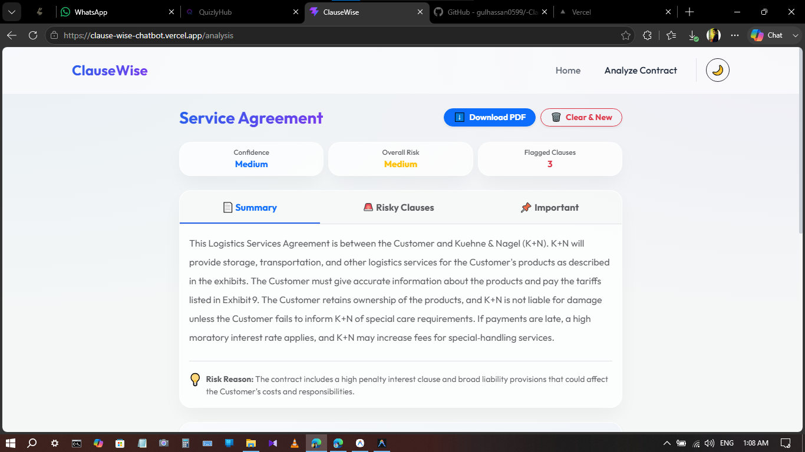
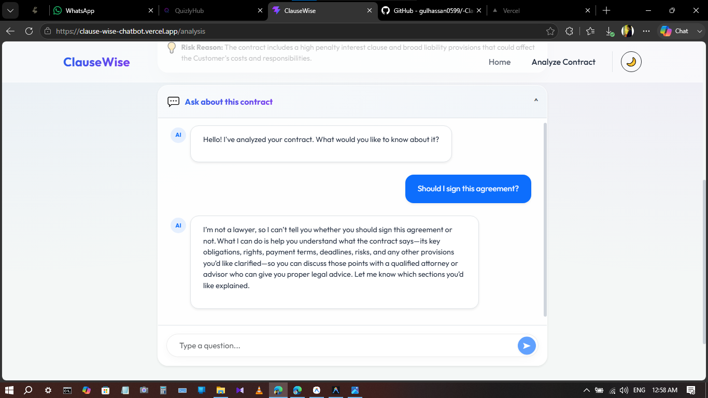

# ⚖️ ClauseWise
> AI-Powered Legal Contract Analyzer & Assistant


## 📖 What is ClauseWise?
**ClauseWise** is a modern, intelligent web application designed to help individuals and professionals rapidly analyze dense legal contracts. 

### The Problem It Solves
Legal contracts are intentionally dense, filled with jargon, and notoriously difficult for the average person to understand. When renting an apartment, signing an employment offer, or agreeing to terms of service, people often sign without fully understanding the risks they are taking on. Hiring a lawyer for everyday contracts is prohibitively expensive. 
**ClauseWise solves this by acting as your personal, free AI legal assistant.** It breaks down complex legalese into beginner-friendly English, automatically identifies hidden predatory clauses, highlights important terms you need to know, and empowers you to chat directly with your contract.

### Who is it for?
- **Everyday Consumers:** Renters, freelancers, and employees who want to understand what they are signing.
- **Small Business Owners:** Founders who need a quick first-pass analysis of vendor or partnership agreements.
- **Professionals:** Anyone looking to save hours of manual reading.

---

## 🌐 Live Demo
**Test the application live here:** [https://clause-wise-chatbot.vercel.app/](https://clause-wise-chatbot.vercel.app/)

---

## ✨ Features
ClauseWise is packed with features designed to make legal analysis effortless:
- **📄 Instant PDF Extraction:** Securely parse and extract text directly from uploaded PDF contracts. Completely stateless—your files are processed in RAM and instantly deleted to protect your privacy.
- **🚨 Risk Analysis:** Automatically flags predatory, vague, or high-risk clauses (e.g., unlimited liability, automatic renewals). Gives severity levels and explains *why* it matters.
- **📌 Important Clause Highlighting:** Summarizes the most critical terms of the contract (payment terms, termination conditions) so you don't miss them.
- **💬 Interactive AI Chatbot:** Ask specific questions about your uploaded contract and get instant, context-aware answers in real-time.
- **🌙 Glassmorphism UI:** A stunning, fully responsive interface featuring seamless Dark/Light mode toggling for comfortable reading.
- **⬇️ Downloadable Reports:** Generate professional, color-coded PDF reports of the AI's analysis for your records.
- **🛡️ Smart Document Detection:** Automatically rejects non-contract documents (like recipes or blank pages) to save processing power and ensure accuracy.

---

## 🤖 The AI Feature: How It Works
ClauseWise's core functionality relies on advanced Large Language Models to read and understand legal text.

### What it does:
When a user uploads a PDF, the backend extracts the raw text and feeds it to the AI along with a strictly engineered **System Prompt**. The AI analyzes the text, determines the document type, assigns a confidence and overall risk score, and structures the output exactly into a requested JSON format. The frontend then parses this JSON to build the interactive dashboard.

### The System Prompt & Instructions:
We engineered a robust system prompt to ensure the AI behaves responsibly and securely. Key instructions include:
1. **Identity & Constraints:** "You are ClauseWise... You are not a lawyer and must never claim to provide legal advice."
2. **Validation:** "Determine whether the uploaded document is a legal contract. If it is NOT, do NOT analyze it. Return the rejection schema."
3. **Extraction:** "Identify the contract type, assess the risk level, identify risky clauses (e.g., Broad Liability, Unfair Payment Terms), and explain why each matters."
4. **Tone:** "Your writing should always be Professional, Neutral, Beginner-friendly, and Clear. Avoid legal jargon whenever possible."
5. **Output Formatting:** "Return ONLY valid JSON. Never wrap the JSON inside Markdown. Never hallucinate facts."

---

## 🛠️ Tools, Services, & AI Models
To build a fast, secure, and beautiful application, ClauseWise utilizes the following stack:

- **Frontend:** React 19, Vite, React Router DOM, Bootstrap 5 (Custom CSS), jsPDF (Report generation), React-Markdown.
- **Backend:** Node.js, Express, Multer (Memory Storage for secure PDF uploads), pdf-parse.
- **AI Integration:** [Groq API](https://groq.com/) utilizing the **`openai/gpt-oss-120b`** model. This provides lightning-fast inference speeds, allowing the backend to process massive contracts and return JSON structured analysis in seconds.
- **Hosting:** 
  - Frontend: Vercel
  - Backend: Railway

---

## 📸 Screenshots

*(Replace the placeholder image paths below with the actual paths to your screenshots)*

### 1. The Dashboard & Analysis

*The main dashboard showing the overall risk score, summary, and flagged clauses.*

### 2. Risk Detection

*Detailed breakdown of risky clauses, their severity, and why they matter to the user.*

### 3. Interactive Chatbot

*The user asking the AI assistant specific questions about their uploaded contract.*

---

## 🚀 How to Run the Project Locally

### 1. Prerequisites
- [Node.js](https://nodejs.org/) (v18 or higher recommended)
- A free API key from [Groq Console](https://console.groq.com/keys)

### 2. Clone the Repository
```bash
git clone https://github.com/gulhassan0599/clausewise.git
cd clausewise
```

### 3. Backend Setup
Navigate to the server directory, install dependencies, and configure your environment.
```bash
cd server
npm install
```
Rename the `.env.example` file to `.env` (or create one) and insert your Groq API key:
```env
PORT=5000
GROQ_API_KEY=your_actual_groq_api_key_here
```
Start the backend server:
```bash
npm start
```
*(The API will run on `http://localhost:5000`)*

### 4. Frontend Setup
Open a new terminal tab, navigate to the client directory, and install dependencies.
```bash
cd client
npm install
```
*(Optional)* If testing against your local backend, ensure your `.env` or configuration points `VITE_API_BASE_URL` to `http://localhost:5000/api`.

Start the frontend development server:
```bash
npm run dev
```
*(The React app will run on `http://localhost:5173`)*

---

## 📂 Project Structure
```text
clausewise/
├── client/                # React Frontend
│   ├── public/
│   └── src/
│       ├── components/    # Reusable UI components (Navbar, UploadArea, Dashboard, Chatbot)
│       ├── pages/         # Route pages (LandingPage, AnalysisPage)
│       ├── services/      # Frontend API fetch logic
│       └── utils/         # PDF Generation logic (jsPDF)
└── server/                # Node.js/Express Backend
    ├── controllers/       # Route request handlers
    ├── middlewares/       # File upload (Multer memory storage) & Error handling
    ├── prompts/           # LLM System Prompts (JSON schemas, strict rules)
    ├── routes/            # Express API routing (/api/contracts)
    └── services/          # Core Business Logic (PDF parsing, AI orchestration)
```

## ⚖️ Disclaimer
**ClauseWise is built for educational and informational purposes only.** It does not provide certified legal advice. Always consult with a qualified attorney before signing binding legal documents.
